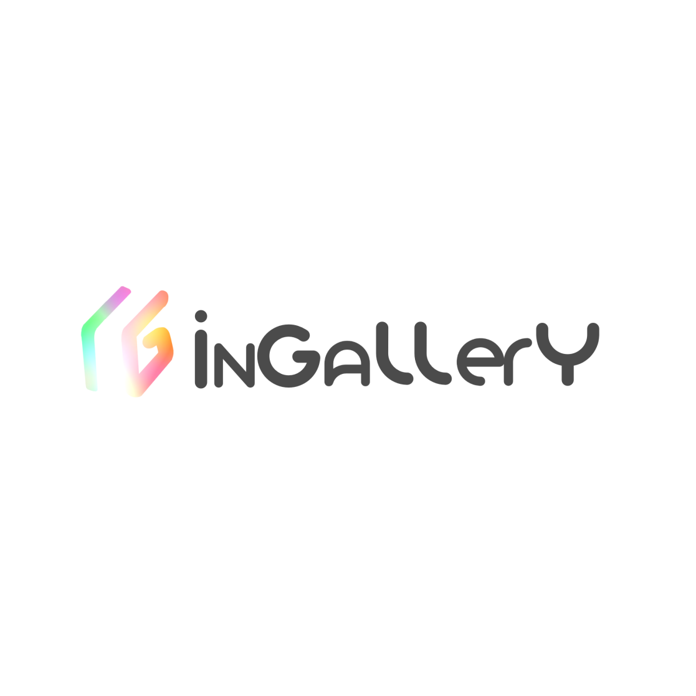

# Image Gallery

This project involves the creation of an interactive image gallery website, designed to provide a sleek and seamless visual experience. The site displays images as thumbnails in a clean grid layout, allowing users to view them in full-screen through a lightbox effect.

## Screenshots


## Features

- Light/dark mode toggle
- Live previews
- Fullscreen mode
- Cross platform

## Color Reference

| Color                      | Hex                                                              |
| -------------------------- | ---------------------------------------------------------------- |
| Primary Background Color   |  #f5f5f5 |
| Border Color               |  #d3d3d3 |
| Text, Icons Color          |  #333333 |
| Accent Color               |  #1a73e8 |
| Secondary Background Color |  #f4e3c1 |

## Tech Stack

**Client:**   

**Software Development:**  

**SVC :**  

## Run Locally

Clone the project

```bash
  git clone https://github.com/Eth3ri0n/image-gallery.git
```

Go to the project directory

```bash
  cd image-gallery
```

## Authors

- [@yangkexin840](https://www.github.com/yangkexin840)
- [@eth3ri0n](https://www.github.com/eth3ri0n)

## 🚀 About Us

We are university students in the field of Multimedia and the Internet in France.

## 🛠 Skills

| Contributors               | Skills                                                           |
| -------------------------- | ---------------------------------------------------------------- |
| [@yangkexin840](https://www.github.com/yangkexin840) |       |
| [@eth3ri0n](https://www.github.com/eth3ri0n) |        |

## 🔗 Links

| Contributors               | Links                                                            |
| -------------------------- | ---------------------------------------------------------------- |
| [@yangkexin840](https://www.github.com/yangkexin840) | [](https://www.instagram.com/pk.yangkexin018) |
| [@eth3ri0n](https://www.github.com/eth3ri0n) | [](https://www.github.com/eth3ri0n) |

## License

[MIT](https://choosealicense.com/licenses/mit/)
